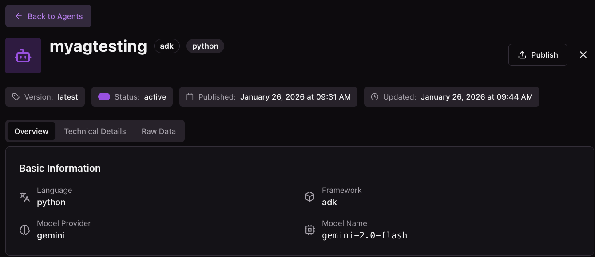
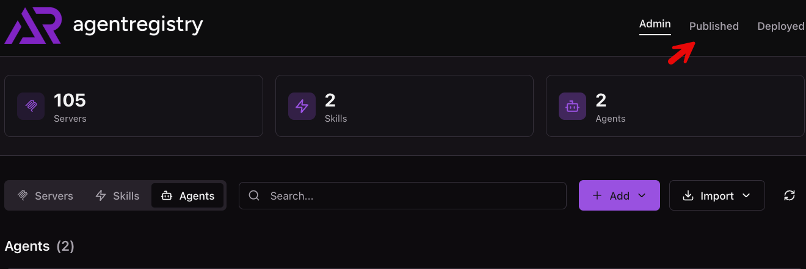
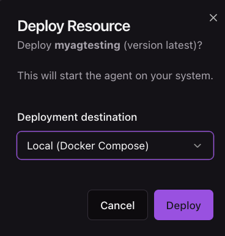
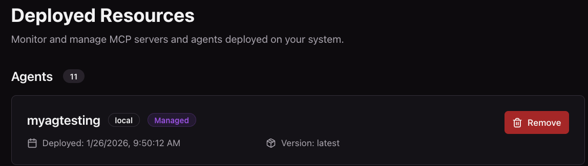

# Deploy and Run Agents Locally

In this doc, you will learn how to create and deploy (or just deploy) an Agent to your local environment from agentregistry.

## Create An Agent Quickstart

If you don't already have an Agent, do the following.

1. Run the following command to initialize/create a new agent that will be in a directory called **myagtesting** wherever you run the following command:

```
arctl agent init adk python myagtesting
```

2. Build and push the agent to agentregistry
```
arctl agent build myagtesting --push
```

## Publish and Deploy In The UI

1. Go into the agents pane.
2. Choose your agent.
3. Click the **Publish** button on the top right



You'll see an output similar to the below:


4. Click on the **Published** tab.


5. Click the purple **Deploy** button on your published agent.


6. Choose **Local (Docker Compose)**


7. Go into the **Deployed** tab on the top right and you'll see your agent deployed successfully.


## Publish and Deploy In The CLI

1. Publish the agent to agentregistry
```
arctl agent publish ./myagtesting/
```

2. Deploy the agent locally via agentregistry
```
arctl agent deploy myagtesting --runtime local
```