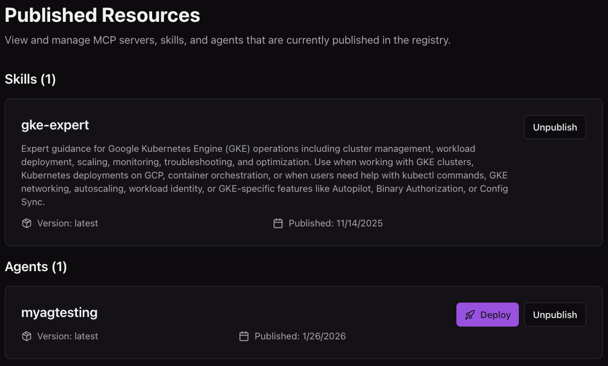
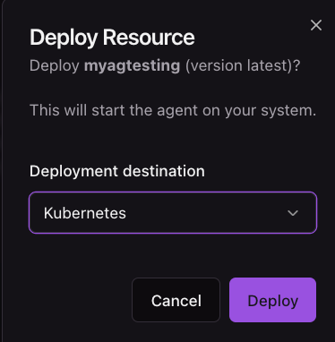

# Deploying Agents In Kubernetes

In this doc, you will learn how to create and deploy (or just deploy) an Agent to your Kubernetes environment from agentregistry.

## Create An Agent Quickstart

If you don't already have an Agent, do the following.

1. Run the following command to initialize/create a new agent that will be in a directory called **myagtesting** wherever you run the following command:

```
arctl agent init adk python myagtesting
```

2. Build and push the agent to agentregistry
```
arctl agent build myagtesting --push
```

## Publish and Deploy In The UI

1. Go into the agents pane.
2. Choose your agent.
3. Click the **Publish** button on the top right

You'll see an output similar to the below:


5. Click the purple **Deploy** button on your published agent.


6. Choose **Kubernetes**


You'll see that the 


7. Open your Kubernetes cluster and run the following to see the agent Pod running.
```
kubectl get pods
```


## Publish and Deploy In The CLI

1. Publish the agent to agentregistry
```
arctl agent publish ./myagtesting/
```

2. Deploy the agent to your Kubernetes cluster that exists in your current Kubeconfig/context and specify the Namespace it is deploying to (in this case, the `default` namespace.)
```
arctl agent deploy myagtesting --runtime kubernetes --namespace default
```