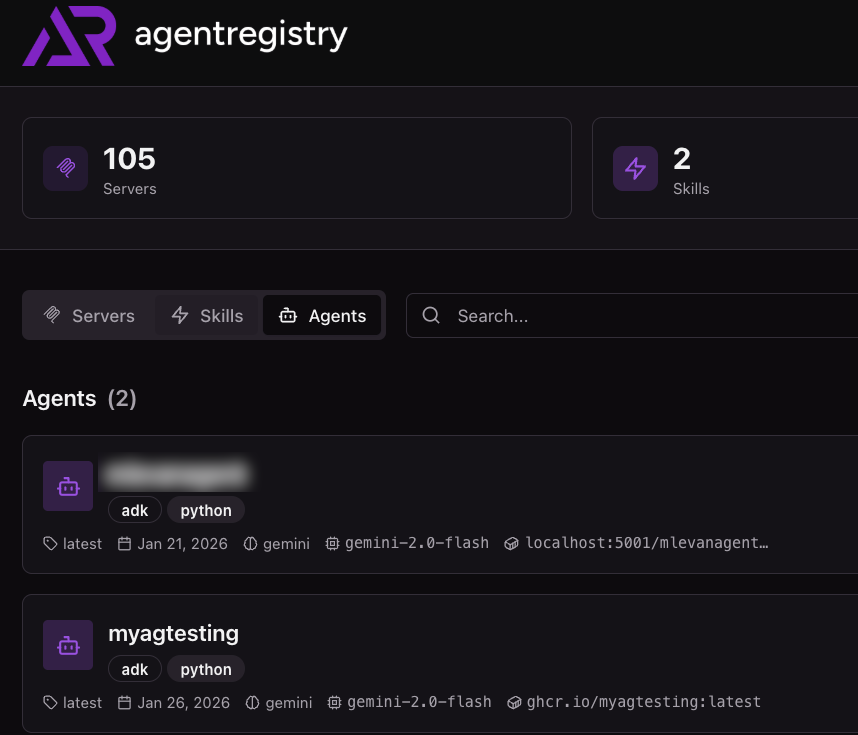
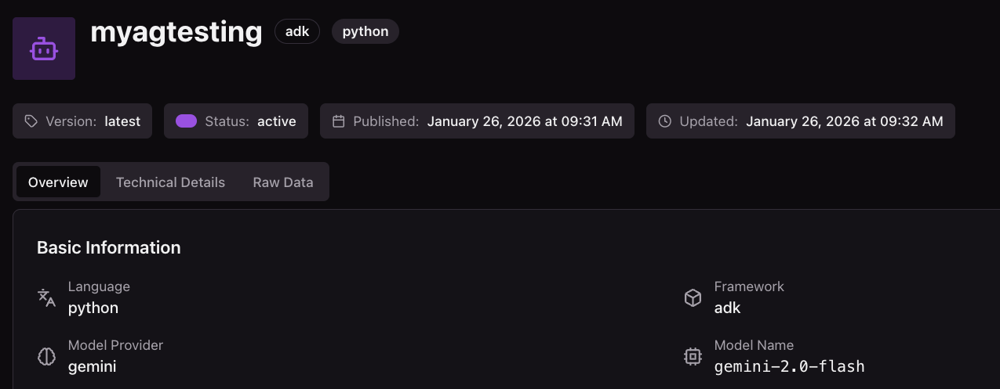

# Publish An Agent To Agentregistry

In this doc, you will see how to publish an agent to agentregistry so it can be used to deploy locally or to Kubernetes via the CLI or UI.


## Create An Agent Quickstart

1. Run the following command to initialize/create a new agent that will be in a directory called **myagtesting** wherever you run the following command:

```
arctl agent init adk python myagtesting
```

## Publish Agent

1. Build the Agent locally via the container engine that is running.
```
arctl agent build myagtesting
```

You'll see an output similar to the below:
```
[+] Building 0.3s (12/12) FINISHED                                                                                                                                                                             docker:desktop-linux
 => [internal] load build definition from Dockerfile                                                                                                                                                                           0.0s
 => => transferring dockerfile: 396B                                                                                                                                                                                           0.0s
 => [internal] load metadata for ghcr.io/kagent-dev/kagent/kagent-adk:0.7.4                                                                                                                                                    0.1s
 => [internal] load .dockerignore                                                                                                                                                                                              0.0s
 => => transferring context: 2B                                                                                                                                                                                                0.0s
 => [1/7] FROM ghcr.io/kagent-dev/kagent/kagent-adk:0.7.4@sha256:98d65130f3dc5374d9b2e1ccb49633e445223e1780747bc8e92fe5d476fac03d                                                                                              0.0s
 => => resolve ghcr.io/kagent-dev/kagent/kagent-adk:0.7.4@sha256:98d65130f3dc5374d9b2e1ccb49633e445223e1780747bc8e92fe5d476fac03d                                                                                              0.0s
 => [internal] load build context                                                                                                                                                                                              0.0s
 => => transferring context: 4.11kB                                                                                                                                                                                            0.0s
 => CACHED [2/7] WORKDIR /app                                                                                                                                                                                                  0.0s
 => CACHED [3/7] COPY myagtesting/ myagtesting/                                                                                                                                                                                0.0s
 => CACHED [4/7] COPY pyproject.toml pyproject.toml                                                                                                                                                                            0.0s
 => CACHED [5/7] COPY README.md README.md                                                                                                                                                                                      0.0s
 => CACHED [6/7] COPY .python-version .python-version                                                                                                                                                                          0.0s
 => CACHED [7/7] RUN uv sync                                                                                                                                                                                                   0.0s
 => exporting to image                                                                                                                                                                                                         0.1s
 => => exporting layers                                                                                                                                                                                                        0.0s
 => => exporting manifest sha256:abcb2a7ed5141d8abf10f09f1e51297409f6738b0589767e4fb7bc6fe82d6915                                                                                                                              0.0s
 => => exporting config sha256:1ebe3f942bb6cd925cae750e59d040f21a33e599d5df77f0fdb632120a32fc11                                                                                                                                0.0s
 => => exporting attestation manifest sha256:73fa547b9e519488eeca98d57b7757ed48952753d0367432d9c21511984010c6                                                                                                                  0.0s
 => => exporting manifest list sha256:80d5a1c13d4274fabba9cca97cf93db4424c1a21ab5be96038ea94d6eef5f736                                                                                                                         0.0s
 => => naming to ghcr.io/myagtesting:latest                                                                                                                                                                                    0.0s
 => => unpacking to ghcr.io/myagtesting:latest                                                                                                                                                                                 0.0s

View build details: docker-desktop://dashboard/build/desktop-linux/desktop-linux/vkwbxmq2ze5lojmo6gglj4tjl
✅ Successfully built Docker image: ghcr.io/myagtesting:latest
```

2. Publish the Agent to agentregistry.
```
arctl agent publish myagtesting
```

You'll now see the agent in agentregistry.



You can also combine the two steps above. Using the `--push` flag, the agent will be published to your registry
```
arctl agent build myagtesting --push
```