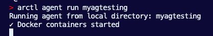
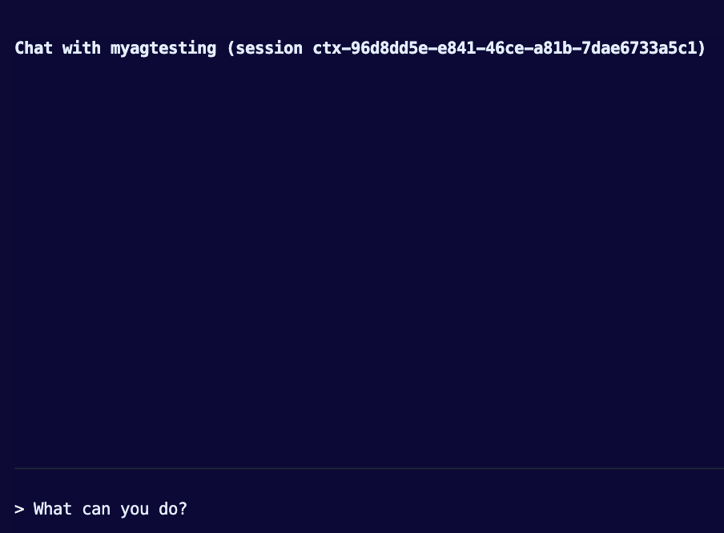

# Running Agents Locally

In this doc, you will learn how to create and deploy (or just deploy) an Agent to your local environment using agentregistry tools.

## Create An Agent

The first step is to initialize a new agent with:
- The agent framework you want to use
- The language you want to use
- The name of your agent

In this case, Agent Development Kit (ADK) is being used with Python and the name of the agent is **myagtesting**

1. Initialize a new Agent
```
arctl agent init adk python myagtesting
```

You'll see an output similiar to the below on your terminal

```
✅ Successfully created adk project in /Users/your_username/your_repomyagtesting
🤖 Model configuration: gemini (gemini-2.0-flash)
📁 Project structure:
   myagtesting/
   ├── myagtesting/
   │   ├── __init__.py
   │   ├── agent.py
   │   ├── mcp_tools.py
   │   └── agent-card.json
   ├── agent.yaml
   ├── pyproject.toml
   ├── Dockerfile
   ├── docker-compose.yaml
   ├── README.md
   └── .python-version
✓ Successfully created agent: myagtesting
   Note: MCP server directories are created when you run 'arctl agent add-mcp'

🚀 Next steps:
   1. cd myagtesting
   2. Customize your agent in myagtesting/agent.py
   3. Build the agent image (add --push to publish to your registry)
      arctl agent build .
   4. Run the agent locally
      arctl agent run .
   5. Publish the agent to AgentRegistry
      arctl agent publish .
```

## Run Agent Locally

Run the agent locally to confirm it works as expected. To do this, you'll need to set an environment variable with your Google API key. The reason why is because by default, ADK uses Gemini. Luckily, generating an API key via Google Studio is initially free. You can generate a key [here](https://aistudio.google.com/api-keys).

1. Create an env variable with your Google API key
```
export GOOGLE_API_KEY=
```

2. Run the agent locally
```
arctl agent run myagtesting
```

You'll now see the Agent starting locally.



3. You can start testing your local agent to begin Agentic action.


