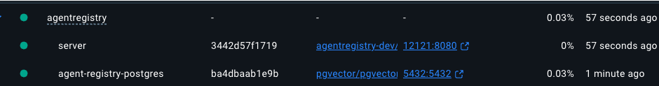
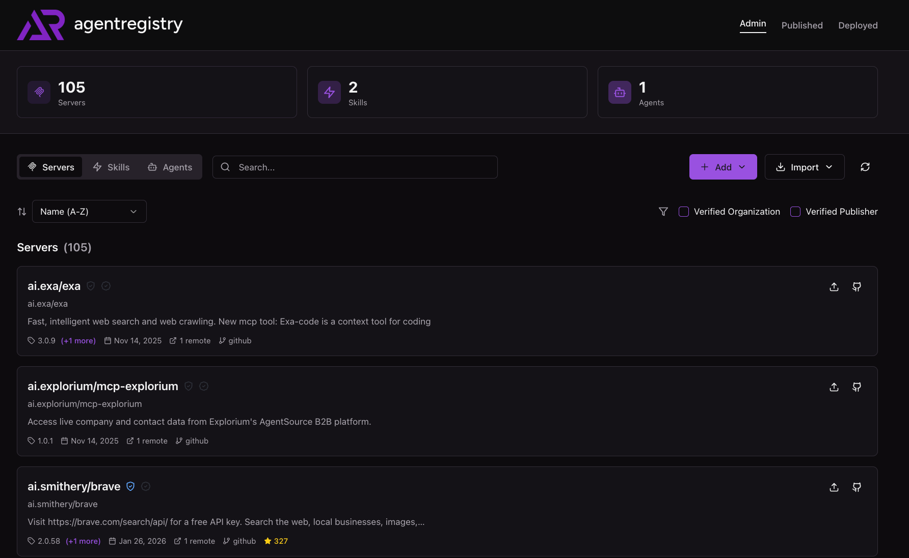

# Getting Started With Agentregistry

Agentregistry is an open-source orchestrator and registry designed to provide a deployed mechanism for Agents, Agent Skills, and MCP Servers. From Agentregistry, you can deploy to Agentic frameworks ranging from AWS AgentCore to GCP Cloud Run. Before deploying to the Agentic frameworks, you can choose which MCP Servers, MCP Server tools, and Agent Skills you want attached to your Agent that exist within agentregistry. 

## Before You Begin

Before starting, you will need a Docker Engine running locally on your machine. The easiest/most universal approach is most likely going to be [Dockerhub](https://hub.docker.com/welcome)

## Install

1. Use the following `curl` command to get the latest release of agentregistry.

```
curl -fsSL https://raw.githubusercontent.com/agentregistry-dev/agentregistry/main/scripts/get-arctl | bash
```

## Running The Registry

When you use any command available within `arctl` from the `mcp` command to the `version` command, the first thing that will be checked is whether or not the agentregistry daemon is running yet.

If the agentregistry daemon is not running, you'll see that it starts automatically when you run any `arctl` command.

For example, running `arctl version` for the first time, you'll see an output similar to the below:

```
Starting agentregistry daemon...
✓ agentregistry daemon started successfully
```



Open Dockerhub (or another Docker engine)

## Accessing The Registry

1. Open a web browser and go to the following:
```
http://localhost:12121/
```

You will see agentregistry running successfully on your local machine.

